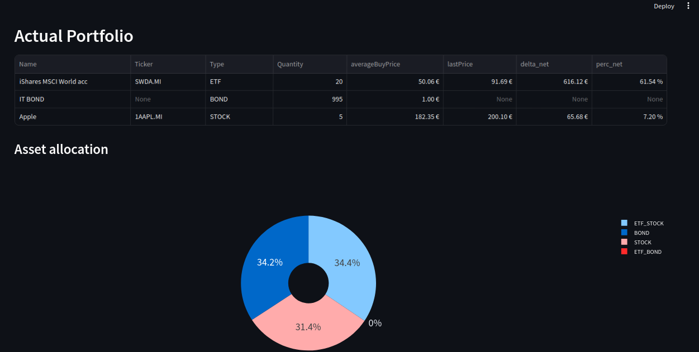
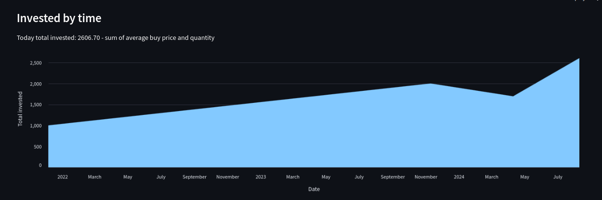

# Simple tool for portfolio management

This is just a simple project to track a investment portfolio.

The next steps are:
- [ ] Turn the operations_main.py and jsons into a DB
- [ ] Get current bonds price
- [X] Get current stock price
- [ ] Train a ML model to predict the portfolio max drawdown

An example of the obtained streamlit data visualization:

